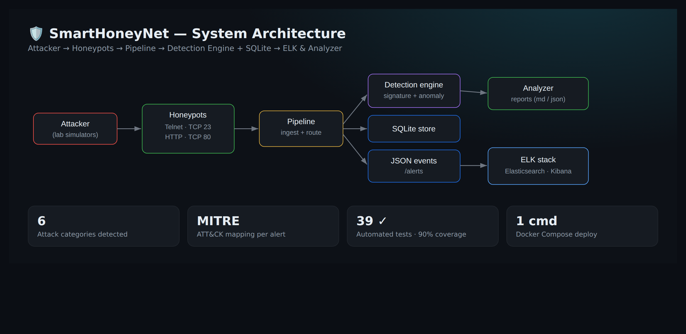
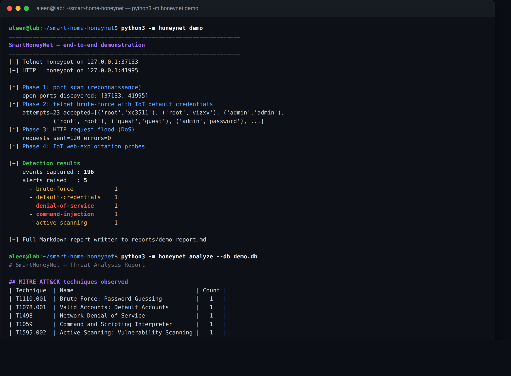
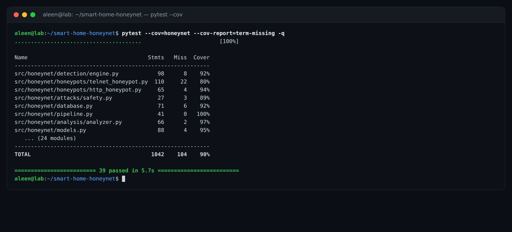
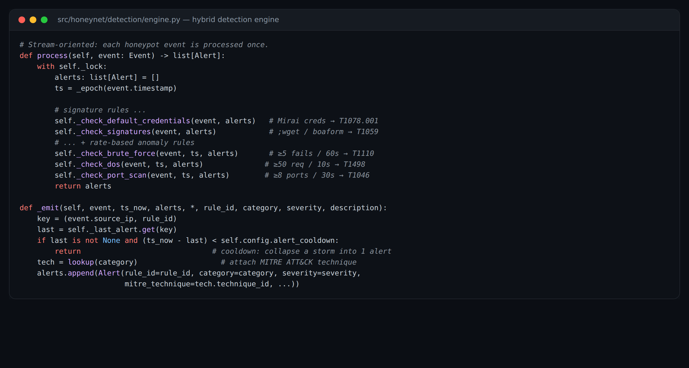

# SmartHoneyNet

**Hunt, Detect and Analyse Attacks on a Smart-Home Network using Honeypots, an IDS and the ELK Stack.**

My University of Jeddah (CCSE) cybersecurity graduation project: a **runnable,
tested, containerised security platform** that deploys honeypots, an IDS and
the ELK stack to hunt, detect and analyse attacks against smart-home / IoT
networks — on a single host, in minutes.

<p align="center">
  
</p>

> ⚠️ **Ethics & scope.** Every component is designed for a **contained lab**.
> The honeypots are low-interaction and never execute attacker input, and the
> included attack simulators **refuse to target anything except loopback /
> RFC-1918 private addresses** (enforced in code — see
> [`safety.py`](src/honeynet/attacks/safety.py)). Use only on systems you own
> or are authorised to test. See [SECURITY.md](SECURITY.md).

---

## What it does

```
             ┌────────────────┐        ┌─────────────────────┐
 attacker ──▶│  Honeypots     │  events│  Pipeline (Logstash)│
 (sim)       │  telnet + http │───────▶│  DB + IDS engine    │
             └────────────────┘        └─────────┬───────────┘
                                                  │ alerts
                              ┌───────────────────▼───────────────────┐
                              │  SQLite store  +  ELK (Elasticsearch,  │
                              │  Logstash, Kibana)  +  Analyzer/report │
                              └────────────────────────────────────────┘
```

1. **Honeypots** emulate vulnerable smart-home devices — a Mirai-style
   **telnet** IoT hub (TCP/23-style) and an **HTTP** device admin panel.
2. A **pipeline** persists every observation to a **SQLite** database and
   mirrors it as JSON for **Logstash → Elasticsearch → Kibana**.
3. A **hybrid IDS engine** (signature + rate-based anomaly) classifies the
   traffic into attack categories and maps each alert to **MITRE ATT&CK**.
4. An **analyzer** produces threat-hunting reports (Markdown/JSON) and Kibana
   dashboards visualise everything in real time.

### Detections implemented

| Rule ID | Category | Technique | Detects |
|---|---|---|---|
| `SSH-TELNET-BRUTE-FORCE` | brute-force | T1110.001 | Rapid failed logins |
| `IOT-DEFAULT-CREDS` | default-credentials | T1078.001 | Mirai/IoT default passwords |
| `HTTP-DOS-FLOOD` | denial-of-service | T1498 | HTTP request floods |
| `PORT-SCAN` | reconnaissance | T1046 | Multi-port probing |
| `SUSPICIOUS-HTTP-PATH` | active-scanning | T1595.002 | IoT exploit URLs (boaform, HNAP1, …) |
| `CMD-INJECTION` | command-injection | T1059 | Shell payloads (`;wget`, `busybox`, …) |

---

## In action

**End-to-end run** — `python3 -m honeynet demo` launches the honeypots, runs
simulated attacks against them, detects and classifies the traffic, then
generates a threat report:

<p align="center">
  
</p>

**Tested** — 39 automated tests, ~90 % coverage, CI on Python 3.9 / 3.11 / 3.12:

<p align="center">
  
</p>

**Hybrid detection engine** — signature rules + rate-based anomaly windows,
every alert mapped to MITRE ATT&CK:

<p align="center">
  
</p>

---

## Quick start (no Docker required)

```bash
cd smart-home-honeynet
python3 -m pip install -e ".[dev]"      # or: pip install -r requirements.txt

# 1) Run the whole thing end-to-end (honeypots + simulated attacks + report)
python3 -m honeynet demo

# 2) Or run the honeypots as a service and attack them yourself
python3 -m honeynet serve --telnet-port 2323 --http-port 8080 &
python3 -m honeynet attack brute-force --host 127.0.0.1 --port 2323
python3 -m honeynet attack dos --url http://127.0.0.1:8080/ --count 200
python3 -m honeynet analyze --db honeynet.db --out reports/analysis.md
```

The `demo` command starts both honeypots on ephemeral ports, launches a port
scan, a credential brute-force and an HTTP flood against them, lets the IDS
classify everything, and writes a full Markdown report to
`reports/demo-report.md`.

## Full stack with ELK (Docker)

```bash
docker compose up -d --build
# Kibana: http://127.0.0.1:5601  → import config/kibana/honeynet-dashboards.ndjson
```

See [docs/deployment.md](docs/deployment.md) for the complete guide.

---

## Testing

```bash
make test              # 38 tests
python3 -m pytest --cov=honeynet --cov-report=term-missing
```

The suite covers the database, detection rules (with synthetic timelines),
live honeypot interaction, the safety guardrails, the pipeline, the analyzer
and a full in-process end-to-end integration test.

## Repository layout

```
smart-home-honeynet/
├── src/honeynet/          # the platform (honeypots, IDS, pipeline, analysis, CLI)
├── config/                # detection rules, Suricata rules, Logstash/ES/Kibana
├── tests/                 # pytest suite
├── docs/                  # architecture, deployment, threat model, runbook
│   └── report/            # improved graduation report (IEEE-style)
├── docker-compose.yml     # honeypots + full ELK stack
└── Dockerfile             # sensor container
```

## Documentation

- [Architecture](docs/architecture.md)
- [Deployment guide](docs/deployment.md)
- [Threat model](docs/threat-model.md)
- [Operations runbook](docs/runbook.md)
- [**Improved graduation report**](docs/report/graduation-report.md)
- [Security policy](SECURITY.md)

## Author

Aleen Saleh Aljohani — aleensaljohani@gmail.com
Cybersecurity Department, CCSE, University of Jeddah.

## License

MIT — see [LICENSE](LICENSE).
